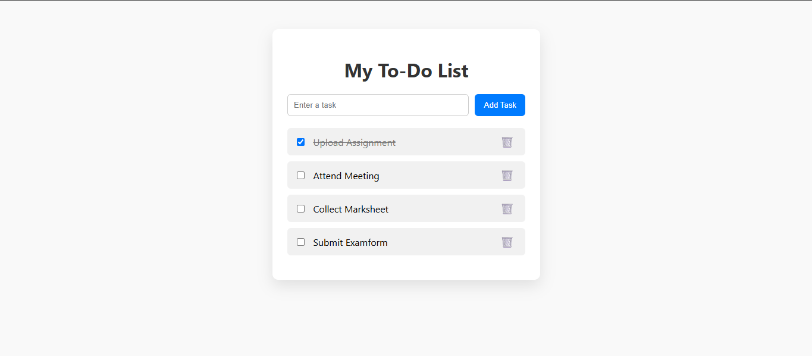

# 📝 Simple To-Do List App

A clean, minimal, and responsive To-Do List application built with **HTML**, **CSS**, and **JavaScript**.  
This app allows users to add, mark as complete, and delete tasks with a simple and user-friendly interface.

---

## 📷 Screenshot
   

---

## 🚀 Features
- ✅ Add new tasks
- ✅ Mark tasks as completed
- ✅ Delete tasks
- ✅ Responsive UI for desktop and mobile
- ✅ Instant updates without page reload

---

## 🛠️ Tech Stack
- HTML5  
- CSS3  
- JavaScript (Vanilla JS)

---

## 🌐 Live Demo
[**View App Here**] https://hsbadgujar.github.io/taskify/ 
